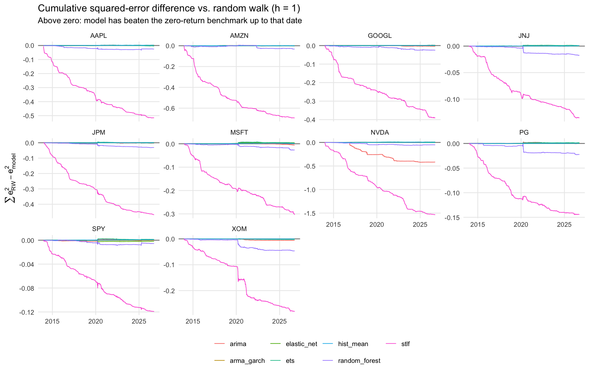
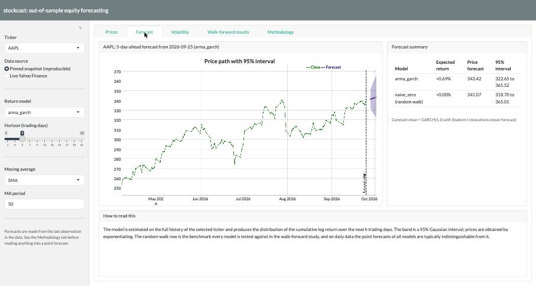

# stockcast: out-of-sample forecasting of daily equity returns and volatility

[](https://github.com/SatvikPraveen/Stock-Price-Prediction/actions/workflows/r-tests.yml)


[](https://stock-prediction-app.shinyapps.io/stockcast/)

A reproducible research framework, packaged as R package **`stockcast`**, that asks a precise question:
**can standard statistical and machine-learning models forecast next-day equity returns better than a random walk once the evaluation is genuinely out of sample, and how well can their variance be forecast?**

Every number in this README is produced by `make experiment` from a pinned data snapshot, scored with proper scoring rules, and tested against a benchmark with formal statistics. Nothing is fitted in-sample and reported as a forecast.

## What the study does

- **Data.** Daily OHLCV for 10 large-cap US names and SPY, 2010 to 2026, from Yahoo Finance, pinned to SHA-256-hashed CSVs in [`data/snapshot/`](data/snapshot/) so that a run is bit-for-bit reproducible.
- **Targets.** `h`-day cumulative log returns (`h` = 1, 5) and their variance, proxied by squared returns and Garman-Klass realised variance from OHLC.
- **Models.** Eight return forecasters (random walk, drift, ARIMA, ETS, STL-ETS, elastic net, random forest, ARMA-GARCH) and five variance forecasters (rolling variance, EWMA, GARCH(1,1), two HAR-RV variants), all behind one `fit()` / `predict()` interface.
- **Protocol.** Rolling-origin walk-forward with an origin on **every trading day** (about 3,200 per ticker), parameters refit monthly and frozen in between, realised targets attached only from the future window. Failures are caught per origin instead of aborting the run.
- **Scoring.** RMSE, MAE, Campbell-Thompson out-of-sample R², CRPS, interval coverage and Winkler score for returns; QLIKE and MSE for variance. **Diebold-Mariano** tests (HLN small-sample correction, overlap-aware) against the benchmark and the **Pesaran-Timmermann** directional test.
- **Economics.** Long/flat and long/short strategies from the sign of the forecast with 5 bp transaction costs; Sharpe ratios with Lo (2002) standard errors, drawdowns and turnover, against buy-and-hold.

Full details, references and limitations: [`docs/methodology.md`](docs/methodology.md).

## Results

<!-- results:start -->

Run `full-20260927` at commit `c3c7745`: 10 tickers, forecast origins every trading day from 2013-12-20 to 2026-09-25, parameters refit every 21 days, 833,560 forecasts. All tables are pooled across tickers at h = 1; per-ticker tables, h = 5 and figures are in [`results/latest/`](results/latest/) and the [rendered report](reports/report.Rmd).

**Headline.** 3 of 7 return models beat the random walk at the 5% level (hist_mean, arma_garch, elastic_net); 3 are significantly worse (random_forest, arima, stlf). The best out-of-sample R² is 0.0017 (hist_mean). Against the random walk **with drift** (the expanding-window mean, `hist_mean`), 0 of 6 models are significantly better. For volatility, 3 of 4 models beat the rolling-variance benchmark at the 5% level; the best is **garch11** (QLIKE 1.608 vs 1.727, DM p <0.001).

#### Return forecasts (h = 1, pooled)

| Model | RMSE | OOS R² | Dir. acc. | PT p | DM p vs RW | OOS R² vs drift | DM p vs drift | CRPS | 95% cov. |
|---|---|---|---|---|---|---|---|---|---|
| hist_mean | 0.01773 | 0.0017 | 0.532 | 0.210 | 0.001 | – | – | 0.00875 | 0.939 |
| arma_garch | 0.01773 | 0.0017 | 0.532 | n/a | 0.010 | -0.0000 | 0.799 | 0.00859 | 0.945 |
| elastic_net | 0.01773 | 0.0016 | 0.530 | 0.260 | 0.018 | -0.0001 | 0.828 | 0.00877 | 0.937 |
| naive_zero | 0.01774 | 0.0000 | – | n/a | n/a | -0.0017 | 0.001 | 0.00876 | 0.939 |
| ets | 0.01775 | -0.0006 | 0.503 | 0.227 | 0.601 | -0.0024 | 0.074 | 0.00878 | 0.937 |
| random_forest | 0.01799 | -0.0279 | 0.507 | 0.361 | <0.001 | -0.0296 | <0.001 | 0.00892 | 0.937 |
| arima | 0.01812 | -0.0429 | 0.521 | 0.054 | <0.001 | -0.0447 | <0.001 | 0.00889 | 0.935 |
| stlf | 0.02139 | -0.4537 | 0.493 | 0.202 | <0.001 | -0.4562 | <0.001 | 0.01106 | 0.874 |

`OOS R²` is relative to the zero-return random walk (Campbell-Thompson) or to the random walk with drift; `DM p` is the two-sided Diebold-Mariano p-value with the HLN correction; `PT p` is the Pesaran-Timmermann directional test (undefined when a model's forecast sign never changes); `CRPS` scores the Gaussian predictive distribution.

#### Variance forecasts (h = 1, pooled)

| Model | QLIKE (r²) | DM p (r²) | QLIKE (GK) | DM p (GK) |
|---|---|---|---|---|
| garch11 | 1.6075 | <0.001 | 0.4204 | <0.001 |
| ewma | 1.6509 | <0.001 | 0.4199 | <0.001 |
| har_gk | 1.6712 | <0.001 | 0.3111 | <0.001 |
| hist_var | 1.7266 | n/a | 0.4490 | n/a |
| har_r2 | 2.1201 | <0.001 | 1.1972 | <0.001 |

QLIKE is reported against squared returns (r², unbiased proxy) and Garman-Klass realised variance (GK, precise but excludes overnight moves); DM tests are against `hist_var`.

#### Trading backtest (long/flat, 5 bp costs, equal-weight, h = 1)

| Model | Ann. return | Ann. vol | Sharpe | Max DD |
|---|---|---|---|---|
| hist_mean | 0.188 | 0.182 | 1.03 ± 0.35 | 0.282 |
| buy_hold | 0.192 | 0.187 | 1.03 ± 0.35 | 0.311 |
| arma_garch | 0.192 | 0.187 | 1.03 ± 0.35 | 0.311 |
| elastic_net | 0.182 | 0.178 | 1.02 ± 0.35 | 0.280 |
| arima | 0.113 | 0.140 | 0.80 ± 0.32 | 0.213 |
| random_forest | 0.085 | 0.125 | 0.68 ± 0.31 | 0.203 |
| ets | 0.061 | 0.121 | 0.51 ± 0.30 | 0.239 |
| stlf | 0.059 | 0.122 | 0.48 ± 0.30 | 0.192 |
| naive_zero | 0.000 | 0.000 | – | 0.000 |

Sharpe ratios are annualised with Lo (2002) standard errors. `hist_mean` is almost always long, so it tracks buy-and-hold minus costs; `naive_zero` never trades.



<!-- results:end -->

## Why this matters

The project started as a Shiny app that "predicted" the closing price from the same day's open, high and low, plus a notebook whose ARIMA/STLF comparison scored a 30-day-ahead forecast against the *last 30 days of its own training data* (a MAPE of about 1% that meant nothing). The rebuild keeps the STL-ETS specification in the model registry precisely so the difference between an in-sample number and a walk-forward one is visible: under a valid protocol it is significantly worse than a random walk. The old outputs are preserved in [`results/legacy_notebook/`](results/legacy_notebook/) and the notebook carries an explanatory note.

## Repository layout

```
R/                      package source: data, features, models, backtest, metrics, strategy, report
tests/testthat/         unit tests on synthetic data (no network), plus a headless test of the app
config/                 experiment.yml (full) and quick.yml (smoke)
scripts/                snapshot_data.R, run_experiment.R, render_report.R, update_readme.R
data/snapshot/          pinned OHLCV CSVs + MANIFEST.json with SHA-256 hashes
results/latest/         tables, figures and provenance of the committed run
results/runs/<id>/      every run (git-ignored): forecasts.rds, config, sessionInfo, provenance
reports/report.Rmd      auto-generated HTML report
shiny_app/              bslib dashboard
docs/methodology.md     protocol, metrics, references
Dockerfile, Makefile    reproducible environment and entry points
```

## Reproduce

```bash
git clone https://github.com/SatvikPraveen/Stock-Price-Prediction.git
cd Stock-Price-Prediction
make deps          # R >= 4.2; installs everything in DESCRIPTION via pak
make install       # needed so parallel workers can load the package
make test          # 60+ tests, no network required
make quick         # ~5-minute smoke run: 2 tickers, weekly origins
make experiment    # full run: ~50 minutes on 8-9 cores
make report        # reports/report.html from results/latest
make app           # launch the dashboard locally
```

Or, with nothing but Docker installed:

```bash
make docker && make docker-run
```

To refresh the data (this changes every result, so treat it as a new experiment): `make data`.

### Compute requirements

The full experiment is about 830,000 forecasts and takes roughly 50 minutes on a 10-core laptop with 9 `future` workers; no GPU or cluster is needed. The work is embarrassingly parallel over (ticker, horizon) tasks, so scaling to hundreds of tickers or intraday data only requires pointing `future::plan()` at a cluster backend such as `future.batchtools` for SLURM.

## Using the package

```r
library(stockcast)
prices <- get_prices("AAPL")                       # from the snapshot; refresh = TRUE to download
feat   <- make_features(prices$AAPL)               # strictly lagged predictors
fc     <- walk_forward(feat, get_models(c("naive_zero", "arima", "garch11")),
                       h = 1, initial = 1000, step = 1, refit_every = 21)
evaluate_forecasts(fc)                             # RMSE, OOS R², DM and PT tests, CRPS, QLIKE ...
backtest_strategy(fc, cost_bps = 5)                # Sharpe, drawdown vs buy-and-hold
dm_test(e1, e2, h = 5)                             # Diebold-Mariano with HLN correction
```

Adding a model is one constructor returning `new_model()`; see [`CONTRIBUTING.md`](CONTRIBUTING.md).

## Dashboard



The [live dashboard](https://stock-prediction-app.shinyapps.io/stockcast/) (auto-deployed from `main` after CI passes) lets you pick any ticker in the snapshot or download one live, view prices with moving averages and Bollinger bands, produce a genuine `h`-day-ahead price forecast with a 95% interval from any registered model next to the random-walk benchmark, compare GARCH conditional volatility with realised volatility, and browse the walk-forward leaderboards and tests.

## Citation

If you use this code or its results, please cite it (see [`CITATION.cff`](CITATION.cff)):

> Praveen, S. (2026). *stockcast: walk-forward evaluation of daily equity return and volatility forecasts* (v1.0.0). https://github.com/SatvikPraveen/Stock-Price-Prediction

## License

MIT. See [`LICENSE.md`](LICENSE.md).
